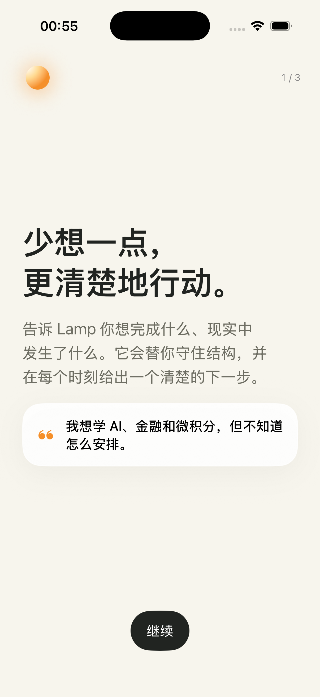
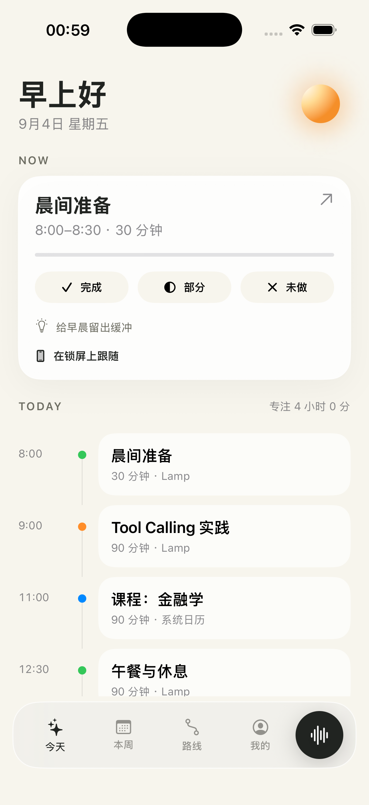

<div align="center">
  <h1>Lamp</h1>
  <p><strong>A personal planning agent for iPhone.</strong></p>
  <p>不是另一个聊天窗口，而是持续回答：我现在应该做什么？</p>

  
  
  
</div>

<table>
  <tr>
    <td width="50%"></td>
    <td width="50%"></td>
  </tr>
</table>

Lamp 是一个原生 SwiftUI iPhone 个人规划 Agent。它的核心不是聊天，而是持续回答：**我现在应该做什么？**

当前仓库包含一个可直接运行的产品原型、确定性排程核心、Live Activity / Dynamic Island 扩展、App Shortcuts，以及已接通的 Supabase + DeepSeek 文字与图片日程链路。

## 已实现

- 三步低摩擦 onboarding。
- Now + Today 主界面与固定/灵活/休息时间线。
- 完成、部分完成、未完成反馈和剩余时长更新。
- “日程”提供周／月／年三个时间层级，支持周期导航、长期目标、月度里程碑和周排程预览。
- 原生五栏底部导航，中央 Lamp 图标使用琥珀色突出且不遮挡内容。
- Tell Lamp：文字、中文语音转写、DeepSeek Vision 图片日程理解与本机 OCR 降级预览。
- 图片可先作为附件加入对话，再结合最多 1200 字的文字或语音说明进行识别；图文冲突会明确标记后交由用户确认。
- 图片候选可编辑、筛选并检查冲突，确认后一次性导入 Today / Week，整次操作可撤销。
- 固定、灵活、休息、重复日程以及周／月／年计划都可按明确范围删除并撤销；外部日历来源不会被改写。
- 每周重复日程、稳定 occurrence ID 与只影响单次的完成、跳过、改期 override。
- “今天很累”临时状态与可预览、确认的轻量重排。
- “Lamp 了解的你”：可查看、删除的记忆与可开关规则。
- 本地 JSON 离线持久化与演示数据。
- Live Activity / Dynamic Island 的倒计时、完成和部分完成控制。
- “打开今天”“告诉 Lamp”App Shortcuts。
- 混合排程引擎、30 个确定性 Swift 核心测试与 23 条全流程 UI 自动化测试。
- Agent Core 首条完整链路：根据现有任务、固定日程和偏好生成今日计划候选；客户端二次验冲突和状态指纹，明确确认前不写入。
- Agent Core 第二条完整链路：记录“未完成”事件后只重排受影响任务；无关任务和固定日程保持不变，同一事件幂等，过期候选不能覆盖新状态。
- Agent Core 第三条完整链路：把“今天有点累，高数少学一点”先由模型转换为受约束的结构化减量决定，再由确定性 Planner 计算具体时间变化；模型不能写日程，确认前不提交，无关安排保持不变。
- 每晚睡眠自动排程与夜晚归属显示；睡眠卡片使用 7 帧舒缓循环插画，在降低动态效果或低电量模式下自动停在熟睡画面。
- Supabase 匿名认证、Postgres/RLS 数据模型和 DeepSeek 工具白名单、风险分类、幂等审计边界。

## 运行

要求：Xcode 26.6 或兼容版本，iOS 18+。

1. 打开 `Lamp.xcodeproj`。
2. 选择 `Lamp` scheme 和任意 iPhone 模拟器。
3. Run。

命令行验证：

```bash
xcodebuild -project Lamp.xcodeproj -scheme Lamp -sdk iphonesimulator \
  -configuration Debug CODE_SIGNING_ALLOWED=NO build
swift test
```

## 云端配置

原型默认使用本地离线数据，不包含任何私钥。要启用云端：

1. 创建 Supabase 项目并执行 `supabase db push`。
2. 在 Auth 设置中开启匿名登录。
3. 部署 `supabase/functions/agent`、`supabase/functions/image-schedule`、`supabase/functions/plan-day`、`supabase/functions/replan-incomplete` 与 `supabase/functions/replan-language`。
4. 仅在服务端配置 `DEEPSEEK_API_KEY`、`DEEPSEEK_MODEL`、`DEEPSEEK_VISION_MODEL` 和 `DEEPSEEK_BASE_URL`；三个 Agent Core 代理另配置 `AGENT_CORE_URL` 与 `AGENT_CORE_SERVICE_TOKEN`。
5. iOS 端只使用可公开的 Supabase publishable key；匿名 session 安全保存在 Keychain。

DeepSeek 永远不获得数据库连接。图片会在本机统一方向、缩放、压缩并临时发送，不写入 Storage；服务端只审计用户、模型、图片哈希、候选数量、耗时和结果状态。

本地验证可在 `agent-core` 中运行 `npm run api`。今日计划使用 `LAMP_AGENT_CORE_URL=http://127.0.0.1:8790/v1/plan-day`；未完成重排使用 `LAMP_AGENT_CORE_REPLAN_URL=http://127.0.0.1:8790/v1/replan-incomplete`；自然语言减量使用 `LAMP_AGENT_CORE_LANGUAGE_URL=http://127.0.0.1:8790/v1/replan-language`。详细边界见 `docs/architecture/0007-agent-core-day-plan-vertical-slice.md`、`docs/architecture/0008-agent-core-incomplete-replan-vertical-slice.md` 与 `docs/architecture/0009-agent-core-language-planner-vertical-slice.md`。

## DeepSeek 联调

文字和图片请求都通过 Supabase 匿名会话调用独立 Edge Function。App 不包含 DeepSeek 私钥；文字接口仅接受白名单工具和周／月／年结构化计划字段，客户端仍负责最终本地写入。网络失败时保留文字与图片输入并提供重试，图片同时保留本机 OCR 只读预览。

## 仍需真机/生产环境完成

- 锁屏直接录音必须按 `docs/architecture/0005-lock-screen-voice.md` 在真机逐项验证；当前可靠路径是部分完成后一步打开最小录音界面。
- 完整计划云同步与正式账户升级仍是后续工作；当前 Supabase 只负责匿名认证、AI 安全代理和最小审计。
- DeepSeek 视觉模型仍为实验模型，保留服务端环境变量切换和 Apple Vision 只读降级路径。
- HealthKit 保留为可选后续集成，不参与医疗判断。

架构决策见 `docs/architecture/`。
